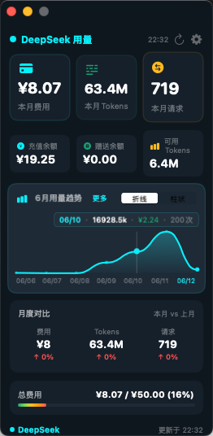

# DeepSeekUsageForMac


**[GitHub 仓库](https://github.com/Negen9527/DeepSeekUsageForMac)** | **[下载 App](https://github.com/Negen9527/DeepSeekUsageForMac/releases)**

---

一个 macOS 桌面悬浮组件，用于实时查看 DeepSeek 平台 API 的用量和费用信息。

## 🌟 功能特性

- **实时用量监控**：实时获取并展示 DeepSeek API 的 Token 消耗和费用情况
- **悬浮窗口**：以悬浮窗口形式常驻桌面，始终在其他窗口之上
- **多维度数据展示**：本月费用、Tokens 消耗、请求数、余额信息
- **趋势分析**：7 日用量趋势图（折线/柱状可切换）
- **月度对比**：本月与上月数据对比，直观了解变化趋势
- **预算管理**：设置月度预算，实时查看预算使用进度
- **菜单栏快捷访问**：点击菜单栏图标快速查看用量摘要
- **WidgetKit 扩展**：支持系统小组件，在通知中心查看用量

## 🎨 界面预览



主仪表盘展示完整的用量数据：
- **统计卡片**：本月费用、Tokens、请求数
- **余额信息**：充值余额、赠送余额、可用 Tokens
- **趋势图表**：7 日用量趋势（折线/柱状切换）
- **月度对比**：本月 vs 上月数据对比
- **预算进度**：渐变色进度条展示预算使用百分比
- **配置面板**：Token 输入、月度预算设置、手动刷新

## 🛠️ 技术选型

| 分类 | 技术 | 版本要求 |
|------|------|----------|
| 语言 | Swift | 5.9+ |
| 框架 | SwiftUI + AppKit | macOS 14.0+ |
| 架构 | MVVM | - |
| 数据存储 | Keychain + UserDefaults | - |
| 构建工具 | XcodeGen | - |

## 📁 项目结构

```
DeepSeekUsageForMac/
├── Shared/                     # 共享模块（主应用与小组件共用）
│   ├── Constants/
│   │   └── AppConstants.swift  # 常量配置（App Group、刷新间隔等）
│   ├── Models/
│   │   └── WidgetSnapshot.swift # 共享快照模型
│   └── Theme/
│       └── AppTheme.swift      # 主题配色和图标常量
├── DeepSeekUsageApp/           # 主应用
│   ├── DeepSeekUsageApp.swift  # @main 入口
│   ├── Services/
│   │   ├── DeepSeekAPIService.swift   # API 调用服务
│   │   ├── KeychainService.swift      # Keychain 安全存储
│   │   └── UsageTrackerService.swift  # 本地用量历史记录
│   ├── ViewModels/
│   │   └── DashboardViewModel.swift   # 数据状态管理
│   └── Views/
│       ├── DesktopWidgetView.swift    # 桌面悬浮窗口
│       ├── ConfigPanelView.swift      # 配置面板
│       └── MenuBarContentView.swift   # 菜单栏面板
├── DeepSeekUsageWidget/        # WidgetKit 扩展
│   ├── DeepSeekUsageWidget.swift      # Widget 入口
│   ├── Provider.swift                 # TimelineProvider
│   └── Views/
│       ├── Components/                # 图表组件
│       │   ├── CircularGaugeView.swift    # 环形仪表盘
│       │   ├── AnimatedPieChartView.swift # 饼图/环形图
│       │   ├── TrendChartView.swift       # 趋势柱状图
│       │   ├── TrendLineChartView.swift   # 趋势折线图
│       │   ├── UsageProgressBar.swift     # 用量进度条
│       │   └── StatsCardView.swift        # 统计卡片
│       ├── SmallWidgetView.swift
│       ├── MediumWidgetView.swift
│       └── LargeWidgetView.swift
├── project.yml                 # XcodeGen 配置
├── build.sh                    # 构建脚本
└── README.md
```

## 🚀 快速开始

### 环境要求

- macOS 14.0+ (Sonoma)
- Xcode 15+ 或 Swift 5.9+
- Python 3（用于生成图标）

### 构建运行

```bash
# 克隆项目
git clone <repository-url>
cd DeepSeekUsageForMac

# 构建应用
./build.sh

# 启动应用
open build/DeepSeekUsage.app
```

### 使用说明

1. **首次使用**：应用启动后显示空白仪表盘
2. **配置 Token**：点击右上角设置按钮（⚙️），输入 DeepSeek 平台 Token
3. **验证保存**：点击"验证并保存"按钮，验证 Token 有效性
4. **查看数据**：配置成功后自动获取用量数据并刷新仪表盘

### API 接口

应用调用以下 DeepSeek 平台接口：

| 接口 | 方法 | URL | 说明 |
|------|------|-----|------|
| 用量统计 | GET | `/api/v0/usage/amount?month={MM}&year={YYYY}` | Token 用量明细 |
| 费用统计 | GET | `/api/v0/usage/cost?month={MM}&year={YYYY}` | 费用明细 |
| 用户摘要 | GET | `/api/v0/users/get_user_summary` | 余额信息 |

请求头：`Authorization: Bearer {TOKEN}`

## 🎯 主要用途

### 目标用户
- DeepSeek 平台开发者
- 需要随时掌握 API Token 消耗和费用情况的用户

### 使用场景
- 实时监控 API 使用情况，避免超支
- 分析用量趋势，优化成本支出
- 快速查看账户余额和可用 Tokens
- 设置预算提醒，合理控制开支

## 🔒 安全特性

- **Token 安全存储**：使用 macOS Keychain 安全存储用户 Token
- **内存保护**：Token 不在内存中打印日志
- **数据加密**：Keychain 自动加密存储敏感信息

## 📊 数据刷新策略

- **自动刷新**：每 15 分钟自动获取最新数据
- **手动刷新**：点击刷新按钮立即更新
- **离线支持**：网络不可用时展示缓存数据

## 📝 开发说明

### 项目配置

项目使用 XcodeGen 管理配置：

```bash
# 生成 Xcode 项目
xcodegen generate
```

### 构建脚本

`build.sh` 包含完整的构建流程：
1. 清理构建目录
2. 编译主应用
3. 编译 Widget 扩展
4. 创建 App Bundle
5. 编译图标资源
6. 代码签名

### 图标生成

运行以下命令生成应用图标：

```bash
python3 create_icns.py
```

## 📄 许可证

MIT License

## 🤝 贡献

欢迎提交 Issue 和 Pull Request！

---

**DeepSeekUsageForMac** - 让 DeepSeek API 用量监控更简单 🚀
